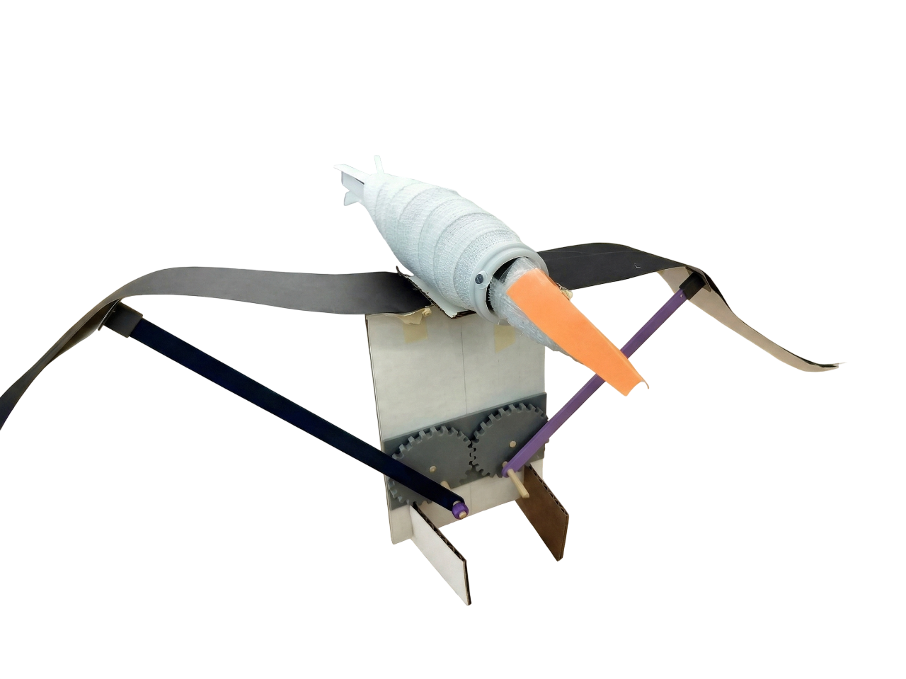
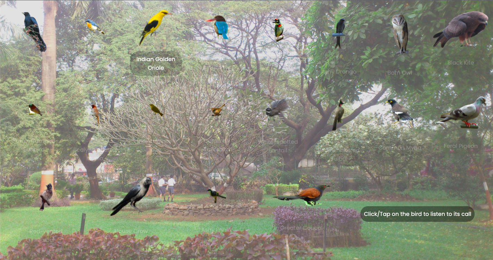
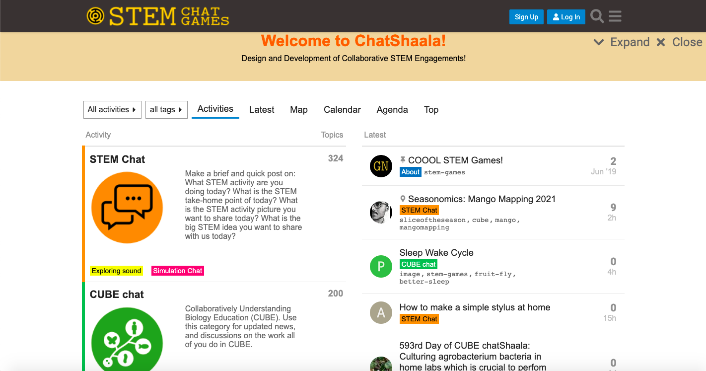
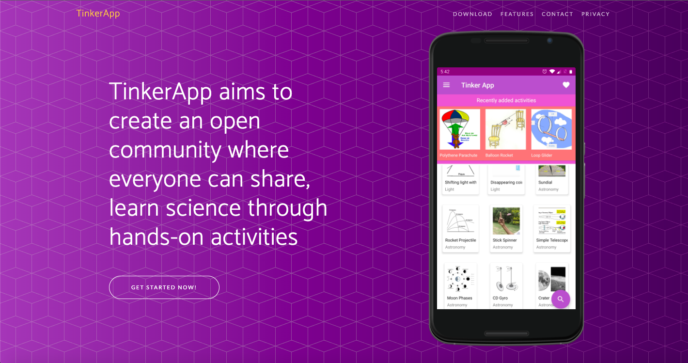

## Hello!

I am a PhD candidate in the Department of Instructional Technology and Learning Sciences at Utah State University. I work in the [Learning Dynamics Lab](https://cehhs.usu.edu/itls/projects/ldl/index.php) under the guidance of [Dr. Hillary Swanson](https://cehhs.usu.edu/itls/people/hillary-swanson). My research focuses on examining learning and designing STEM-rich learning environments that weave in maker-centered, model-based, and embodied pedagogies.

In my current work, I use design-based research methods to develop a computationally rich microworld, [Amazing Birds](https://amazing-birds.gitlab.io/), to introduce learners to avian engineering. I am especially curious to understand how learners make sense of the prototyping choices and adapt their approach to navigate the design space. The broader goal of the project is to systematically integrate engineering sciences practices into K-12 education.

Another strand of my work explores how GenAI could be effectively leveraged in education research and practice. My preliminary work examines the role of GenAI while we enact qualitative methodologies such as the [grounded theory approach](https://doi.org/10.1145/3663433.3663456). In my design work, I have actively used GenAI tools to develop an interactive learning environment (see the [Amazing Birds platform](https://amazing-birds.gitlab.io/)).

My teaching and outreach experiences span interactions with primary-grade learners, graduate students, and educators. At USU, I have had the opportunity to teach making and instructional design courses at both the undergraduate and graduate levels. Beyond academia, I love exploring ways to make research and scientific ideas accessible to the general populace through diverse media representations, such as animated stories and interactive simulations, and by constructing tangibles, such as DIY toys. (See [science communication](#science-communication)).

  <strong id="research-interests-label">Research Interests</strong>
  <ul class="research-interest-list">
    <li>Embodied Cognition</li>
    <li>Makerspaces</li>
    <li>STEM+CT Education</li>
    <li>GenAI in Education</li>
    <li>Engineering Sciences</li>
    <li>Design-based Research</li>
  </ul>

## Publications

A complete list of publications is available on my [Google Scholar](https://scholar.google.com/citations?user=JzOlUSQAAAAJ&hl=en) page.

  <button type="button" aria-pressed="true" aria-controls="publication-list" data-publication-filter="all">All</button>
  <button type="button" aria-pressed="false" aria-controls="publication-list" data-publication-filter="science-engineering-practices">Science and Engineering Practices</button>
  <button type="button" aria-pressed="false" aria-controls="publication-list" data-publication-filter="embodied-cognition">Embodied Cognition</button>
  <button type="button" aria-pressed="false" aria-controls="publication-list" data-publication-filter="computational-thinking">Computational Thinking</button>
  <button type="button" aria-pressed="false" aria-controls="publication-list" data-publication-filter="qualitative-research">Qualitative Research</button>

Showing all 7 publications.

<article class="publication-item" data-publication-topics="embodied-cognition" markdown="1">

**[Making Cognition: A Mechanism Account of the Way Humans Develop the Ability to Build and Alter Their Environments](https://doi.org/10.1007/s11229-025-05081-9)** 
Sanjay Chandrasekharan, **Ravi Sinha**, and Geetanjali Date 
*Synthese, 206, Article 7, 2025* 

Through the lens of enactive cognition, the paper presents an account of the cognitive mechanisms that lead up to human making and shows how changes to these mechanisms enable further making.

[DOI](https://doi.org/10.1007/s11229-025-05081-9)

</article>
<article class="publication-item" data-publication-topics="science-engineering-practices" markdown="1">

**[Using Model-Based Reasoning to Refine Student Thinking: An ENA Analysis of Teacher Moves](https://doi.org/10.1145/3713043.3728860)** 
**Ravi Sinha**, Idris Solola, Rida Munir, Hillary Swanson, and Ha Nguyen 
*24th Interaction Design and Children Conference (IDC '25), 2025* 

We examined the pedagogical moves a teacher used to engage middle school students in model-based reasoning during a seven-day energy conservation unit. We used thematic analysis and epistemic network analysis to characterize patterns within and across modeling activities.

[DOI](https://doi.org/10.1145/3713043.3728860)

</article>
<article class="publication-item" data-publication-topics="qualitative-research" markdown="1">

**[The Role of Generative AI in Qualitative Research: GPT-4's Contributions to a Grounded Theory Analysis](https://doi.org/10.1145/3663433.3663456)** 
**Ravi Sinha**, Idris Solola, Ha Nguyen, Hillary Swanson, and LuEttaMae Lawrence 
*ACM Symposium on Learning, Design and Technology (LDT '24), 2024* 

We reflect on using GPT-4 during exploratory and focused coding phases in a grounded theory analysis of classroom transcript data to conceptualize a responsive teaching approach. We present moments when the model contributed to code generation, comparison, and refinement.

[DOI](https://doi.org/10.1145/3663433.3663456)

</article>
<article class="publication-item" data-publication-topics="science-engineering-practices" markdown="1">

**[Epistemic Games at the Frontier: A Characterization of Emerging Science and Engineering Practices](https://doi.org/10.22318/icls2024.337675)** 
**Ravi Sinha**, Hillary Swanson, Geetanjali Date, and Sanjay Chandrasekharan 
*18th International Conference of the Learning Sciences (ICLS), 2024 · Short paper* 

We characterized the Paperfuge prototyping process through the epistemic forms and games framework. We temporally decomposed the prototyping journey into six episodes. We proposed a preliminary construct of Prototype-Based Imagining as a marker of engineering sciences thinking.

[DOI](https://doi.org/10.22318/icls2024.337675)

</article>
<article class="publication-item" data-publication-topics="embodied-cognition computational-thinking" markdown="1">

**[From Embodied Doing to Computational Thinking in Kindergarten: A Punctuated Motor Control Model](https://doi.org/10.1145/3594781.3594794)** 
**Ravi Sinha**, Hillary Swanson, Jody Clarke-Midura, Jessica F. Shumway, Victor R. Lee, and Sanjay Chandrasekharan 
*ACM Symposium on Learning, Design and Technology (LDT '23), 2023* 

We propose a motor-control characterization of how computational thinking can emerge from embodied performance in a tangible coding task. The paper analyzes video data from four kindergartners learning to program Cubetto to empirically illustrate the mechanism.

[PDF](./assets/pdf/ldt23-4-final.pdf) · [DOI](https://doi.org/10.1145/3594781.3594794)

</article>
<article class="publication-item" data-publication-topics="science-engineering-practices" markdown="1">

**[Reshaping Makerspaces to Learn Frontier Making Practices](https://episteme9.hbcse.tifr.res.in/wp-content/uploads/2023/04/epi9-proceedings_for_web.pdf)** 
Geetanjali Date, **Ravi Sinha**, and Sanjay Chandrasekharan 
*9th International Conference to Review Research in Science, Technology, Engineering, and Mathematics Education (epiSTEME), 2022* 

We describe the Paperfuge design process, extract its key engineering design practices, and represent them as an expanding spiral pattern of the design space to suggest ways of integrating frontier making practices into school makerspaces.

[PDF](./assets/pdf/Reshaping_Makerspaces_to_Learn_Frontier.pdf) · [Link](https://episteme9.hbcse.tifr.res.in/wp-content/uploads/2023/04/epi9-proceedings_for_web.pdf)

</article>
<article class="publication-item" data-publication-topics="embodied-cognition science-engineering-practices" markdown="1">

**[Embodied Learning in Makerspaces](https://library.apsce.net/index.php/ICCE/article/view/4252)** 
**Ravi Sinha**, Geetanjali Date, and Sanjay Chandrasekharan 
*29th International Conference on Computers in Education (ICCE), 2021* 

We propose a cognitive account of learning in makerspaces by outlining two mechanisms from embodied cognition. We illustrate how they can explain building cognition across three frontier making practices and inform the reimagining of makerspaces.

[PDF](./assets/pdf/icce-2021.pdf) · [Link](https://library.apsce.net/index.php/ICCE/article/view/4252)

</article>

## Projects

### [Amazing Birds](https://amazing-birds.gitlab.io/)

An interactive learning environment for exploring avian-inspired engineering through research cases, simulations, prototyping, and reflection activities.

### [BirdApp](https://birds.hbcse.tifr.res.in/)

Collaborator: [Adithi Muralidhar](https://dnte.hbcse.tifr.res.in/members/adithi-muralidhar/). An interactive educational resource depicting some common species found across India to inspire educators (and any curious individual) to initiate conversations around nature observation. The beta version was launched on World Environment Day, 2021.

### [metaStudio](https://metastudio.org)

Principal Investigator: [Prof Nagarjuna G.](https://www.hbcse.tifr.res.in/people/former-members/nagarjuna-g/nagarjuna-g) I was part of the core team in design and implementation of the metaStudio, a conversation-first platform for the STEM community, with 1500+ members since July 2019; Active contributor in crafting and curating STEM-rich tinkering challenges; Members are encouraged to engage in process documentation during making as well as share their feedback with others; Platform has provision of granting [badges](https://metastudio.org/badges) when an academic habit is demonstrated; Initiated dedicated discourse space [turtleChat](https://metastudio.org/c/turtlechat/35) to support exploration of computational concepts.

### [TinkerApp](https://tinkerapp.github.io/)

Collaborator: Vivek Pradhan. A mobile app with curated hands-on science projects; Downloaded by 10000+ educators and children worldwide.

## Teaching

**Teaching Assistant - eLearning Authoring Tools (ITLS 6245)** 
Department of Instructional Technology and Learning Sciences, Utah State University 
*Summer 2026*

**Instructor - Digital Making and Learning (ITLS 6270/5270)** 
Department of Instructional Technology and Learning Sciences, Utah State University 
*Spring 2026*

## Science Communication

### Popular Writing

**[Nudging Students' Designs](https://publications.azimpremjiuniversity.edu.in/4150/)** 
**Ravi Sinha**, A. K. Pardeshi, and D. Chari 
*I Wonder, Azim Premji University, 8, 42-46, 2022* 
[PDF](./assets/pdf/Nudging_Students_Designs.pdf) · [Link](https://publications.azimpremjiuniversity.edu.in/4150/)

**[The Not So Random Story](https://www.teacherplus.org/the-not-so-random-story/)** 
Amit Dhakulkar and **Ravi Sinha** 
*Teacher Plus, 2021*

**Aakho Me Chamak (Gleam in the Eyes)** 
Manish Jain and **Ravi Sinha** 
*A booklet for doing science using simple materials, 2017* 
[Hindi](./assets/pdf/1-2.pdf) · [English](./assets/pdf/1-1.pdf)

### Animated Science Communication Videos

I worked on the following collection of animated popular science videos: [Playlist](https://www.youtube.com/watch?v=b0NM_mjo7QE&list=PLTtqYIBJI7Zd2itCZNZVNRgToOwJFhYGs)

[Danger of Space Travel without Spacesuit (CLI, IITGN)](https://www.youtube.com/watch?v=9qZQOJ-eMf8&list=PLTtqYIBJI7Zd2itCZNZVNRgToOwJFhYGs&index=6)  

[History of Genetics (CLI, IITGN)](https://www.youtube.com/watch?v=ijx6G5GZOJ8&list=PLTtqYIBJI7Zd2itCZNZVNRgToOwJFhYGs&index=4)  

[World’s narrowest fluid channel using Graphene (CLI, IITGN)](https://www.youtube.com/watch?v=mbQahUMADIM&list=PLTtqYIBJI7Zd2itCZNZVNRgToOwJFhYGs&index=5)  

[How much land does a man need? Part 1 (CLI, IITGN)](https://www.youtube.com/watch?v=9H7-NEdJ6XA&list=PLTtqYIBJI7Zd2itCZNZVNRgToOwJFhYGs&index=8)  

[How much land does a man need? Part 2 Proof (CLI, IITGN)](https://www.youtube.com/watch?v=lmcGF4lghc4&list=PLTtqYIBJI7Zd2itCZNZVNRgToOwJFhYGs&index=7)

