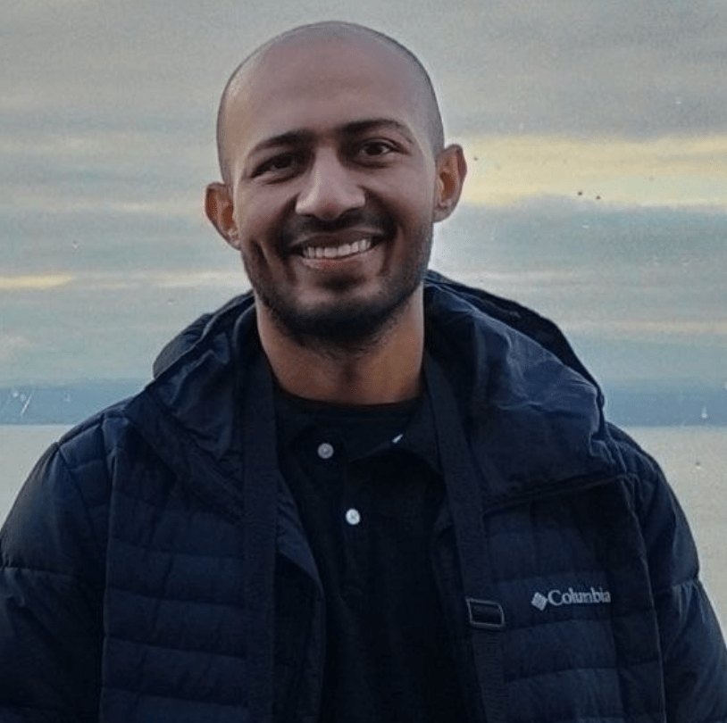

I am a maker-educator and researcher. I started my journey in the area of recreational Science Education, designing simple toys and activities that can be used to elicit scientific concepts. Later, I became interested in Makerspaces and worked closely with groups that were exploring challenges and possibilities to bring maker-focused education to mainstream education.
I am deeply interested in designing user experiences and learning environments that afford diverse participation in the context of maker-centered STEM education, especially foregrounding the engineering dimension. Currently, I'm a doctoral student in the Instructional Technology and Learning Sciences program at Utah State University, exploring ideas related to Embodied Cognition (EC) to understand the nature of learning in Making & Tinkering (M&T) practices. I also enjoy being part of outreach endeavors in the area of science communication.

> **Research Interests** _Embodied Cognition, Makerspaces, Engineering Education, STEM Education, Computational tinkering, DIY STEM Toys_

## Conference Participation

**Sinha, R.**, Swanson, H., Clarke-Midura, J., Shumway, J. F., Lee, V. R., & Chandrasekharan, S. (2023). [From Embodied Doing to Computational Thinking in Kindergarten: A Punctuated Motor Control Model.](./assets/pdf/ldt23-4-final.pdf) In Learning, Design and Technology (LDT '23) (pp. 1-10). June 23, 2023, Evanston, IL, USA: ACM. [https://doi.org/10.1145/3594781.3594794](https://doi.org/10.1145/3594781.3594794)

Date, G., **Sinha, R.**, & Chandrasekaran, S. (2022). [Reshaping Makerspaces to Learn Frontier Making Practices.](./assets/pdf/Reshaping_Makerspaces_to_Learn_Frontier.pdf) Proceedings of EPISTEME 9 International Conference to Review Research in Science, Technology and Mathematics Education, 9, 373–379.

**Sinha, R.**, Date, G., & Chandrasekharan, S. (2021, Nov). Full Paper (with oral presentations). [Embodied Learning in Makerspaces.](./assets/pdf/icce-2021.pdf) Rodrigo, M. M. T. et al. (Eds.) (2021)._Proceedings of the 29th International Conference on Computers in Education. Asia-Pacific Society for Computers in Education,10._ [ Slides](./assets/pdf/icce-slides-2021.pdf) 

**Sinha, R.** & Dhakulkar, A. (2021, June).  Abstracts (with oral presentations) & Poster. [Exploring Turtle Blocks in an online collaborative environment.](https://repository.isls.org/handle/1/7330) Hmelo-Silver, C. E., De Wever, B., & Oshima, J. (Eds.). (2021). _Proceedings of the 14th International Conference on Computer-Supported Collaborative Learning - CSCL 2021. Bochum, Germany (Online Event): International Society of the Learning Sciences., 2._[ Slides](https://ravi312.github.io/CSCL2021/)

Karnam, DP., **Sinha, R.**, & Pardeshi, A. (2020, June). Abstracts (with oral presentations) & Poster. [Figuring the 'making' with Indian teachers: Can we re-imagine STEM learning?.](https://repository.isls.org/handle/1/6549) In Gresalfi M., & Horn, I. S. (Eds.). _Proceedings of The Interdisciplinarity of the Learning Sciences, 14th The International Conference of the Learning Sciences (ICLS) 2020, Volume 4. (pp. 2339-2340), Nashville, Tennessee: (Online): International Society of the Learning Sciences._

## Articles

Jain, M. & **Sinha,R.** (2017). **"Aakho me chamak" ("Gleam in the eyes")**, a booklet for doing science using simple materials alongside the scientific explanation. [(Hindi)](./assets/pdf/1-2.pdf) [(English)](./assets/pdf/1-1.pdf)

Dhakulkar, A., & **Sinha, R.** (2021, November). The not so random story. Teacher Plus. [https://www.teacherplus.org/the-not-so-random-story/](https://www.teacherplus.org/the-not-so-random-story/)

## Projects

### [BirdApp](https://birds.hbcse.tifr.res.in/)

Collaborator: [Adithi Muralidhar.](https://dnte.hbcse.tifr.res.in/members/adithi-muralidhar/) An interactive Educational Resource depicting some common species found across India to inspire educators (and any curious individual) to initiate conversation around nature observation. Beta version was launched on World Environment Day, 2021. 

### [metaStudio](https://metastudio.org)

Principal Investigator: [Prof Nagarjuna G.](https://www.hbcse.tifr.res.in/people/former-members/nagarjuna-g/nagarjuna-g) Core team in design and implementation of the metastudio, a conversation-first platform for the STEM community, with 1500+ members since Jul 19; Active contributor to crafting and curation of STEM-rich tinkering challenges; Members are encouraged to engage in process documentation during making as well as share their feedback with others; Platform has provision of granting [badges](https://metastudio.org/badges) when an academic habit is demonstrated; Initiated dedicated discourse space [turtleChat](https://metastudio.org/c/turtlechat/35) to support exploration of computational concepts.

### [TinkerApp](https://tinkerapp.github.io/)

Collaborator: Vivek Pradhan. A mobile app with curated hands-on science projects; Downloaded by 10000+ educators/children worldwide.

## Outreach

### Animated Science Communication Videos

Worked on the following collection of animated science popularization films:  [Playlist](https://www.youtube.com/watch?v=b0NM_mjo7QE&list=PLTtqYIBJI7Zd2itCZNZVNRgToOwJFhYGs)

[Danger of Space Travel without Spacesuit (CLI, IITGN)](https://www.youtube.com/watch?v=9qZQOJ-eMf8&list=PLTtqYIBJI7Zd2itCZNZVNRgToOwJFhYGs&index=6)  

[History of Genetics (CLI, IITGN)](https://www.youtube.com/watch?v=ijx6G5GZOJ8&list=PLTtqYIBJI7Zd2itCZNZVNRgToOwJFhYGs&index=4)  

[World’s narrowest fluid channel using Graphene (CLI, IITGN)](https://www.youtube.com/watch?v=mbQahUMADIM&list=PLTtqYIBJI7Zd2itCZNZVNRgToOwJFhYGs&index=5)  

[How much land does a man need? Part 1 (CLI, IITGN)](https://www.youtube.com/watch?v=9H7-NEdJ6XA&list=PLTtqYIBJI7Zd2itCZNZVNRgToOwJFhYGs&index=8)  

[How much land does a man need? Part 2 Proof (CLI, IITGN)](https://www.youtube.com/watch?v=lmcGF4lghc4&list=PLTtqYIBJI7Zd2itCZNZVNRgToOwJFhYGs&index=7)  

